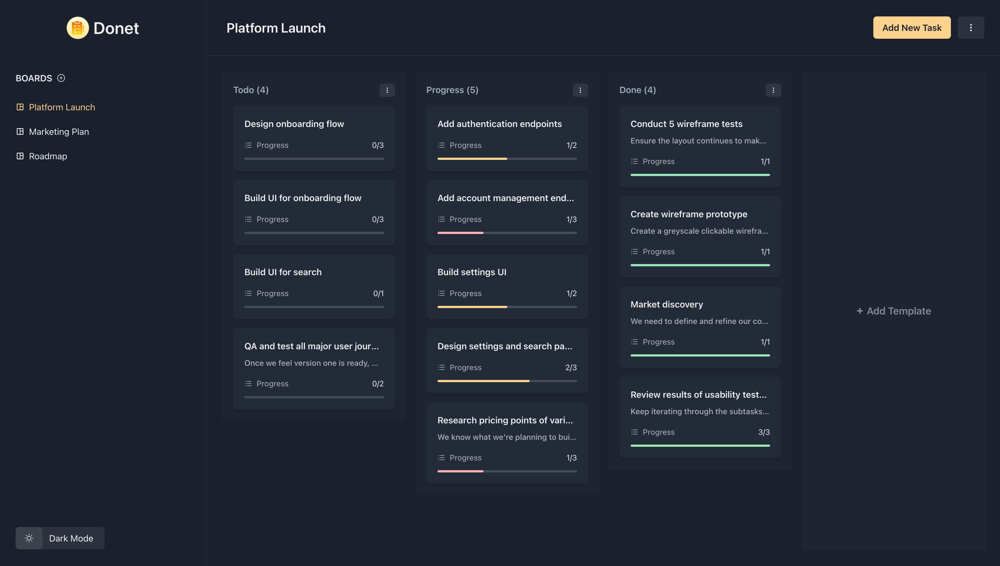

# Donet

A full-stack task management app built with React & Supabase.

## Table of contents

- [Introduction](#introduction)
- [Features](#features)
- [How does it work?](#how-does-it-work)
- [Demo](#demo)
- [Technologies](#technologies)
- [Lessons learned](#lessons-learned)
- [Feedback](#feedback)

## Introduction

I built this project (the last one in my portfolio) with the purpose of applying all of the knowledge acquired from my two previously developed projects [corteza](https://github.com/joangavelan/corteza) and [one plate](https://github.com/joangavelan/one-plate). The concept of this app is simple, a task management app where you can keep your tasks saved and organized in one place.

## Features

- Authentication with Supabase.
- CRUD your boards, templates and tasks.
- Drag and drop.
- Light/Dark mode.
- Responsive Design.

## How does it work?

1. Login or register an account if you don't have one.
2. Once you've logged in to the app, create your first board.
3. Within this board, you can create templates, which are the columns that will be used to group your tasks.
4. Create your first task, a task can contain the following fields: title, description, subtasks, and the template it will belong to.
5. Click on your task to display a full summary of it and to access the options to modify it.
6. Drag and drop your tasks between templates at your convenience.
7. Once you have completed a task, you can delete it, just as you can do with your templates and boards.

## Demo

Here is the link to the working app: https://donet.vercel.app/

## Technologies

- [Vite](https://vitejs.dev/) - Frontend tool to set up a development environment for frameworks like React.
- [Supabase](https://supabase.com/) - The open source Firebase alternative designed to help developers spin up their backend.
- [Chakra UI](https://chakra-ui.com/) - Simple, modular and accessible component library that gives you the building blocks you need to build your React applications.
- [React Router](https://reactrouter.com/en/main/) - The standard library for client-side routing in React.
- [React Beautiful DND](https://github.com/atlassian/react-beautiful-dnd) - Beautiful and accessible drag and drop for lists with React.
- [React Hook Form](https://react-hook-form.com/) - Performant, flexible and extensible forms with easy-to-use validation.
- [Zod](https://zod.dev/) - TypeScript-first schema validation with static type inference.
- [React Query](https://tanstack.com/query/v4/) - Powerful asynchronous state management for TS/JS, React, Solid, Vue and Svelte.

## Lessons Learned

- I learned that keeping things in sync with the backend isn't always an easy task. Maintaining the correct order of tasks when a user drags and drops a task between templates was the biggest challenge of this project. I had to send an update to the server for all the reordered tasks in both templates and could not wait for the response to arrive as the update on the frontend had to happen instantly. I managed to solve this by implementing optimistic updates with the help of React Query.
- Although Supabase facilitates much of the work involving the backend so I can focus more on the frontend, I definitely had to dig into some of the concepts that come with it, such as database schemas, security rules, auth tokens, and more; giving me a clear picture of how everything is connected between both worlds.
- Got fascinated by the way of working with Chakra UI, a component library based on a design system that you can customize to fit your needs. Tons of time saved by using this beautiful library.
- React query was a game-changer for me, the way it simplifies data fetching, error handling, caching, and server state management made my workflow a lot easier.

## Feedback

If you wish to provide any feedback or just to have a little chat you can contact me through the following email: joangavelan@gmail.com.
